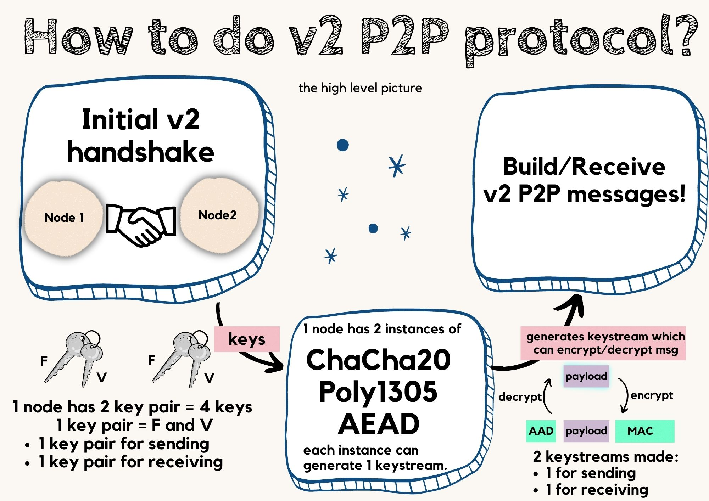
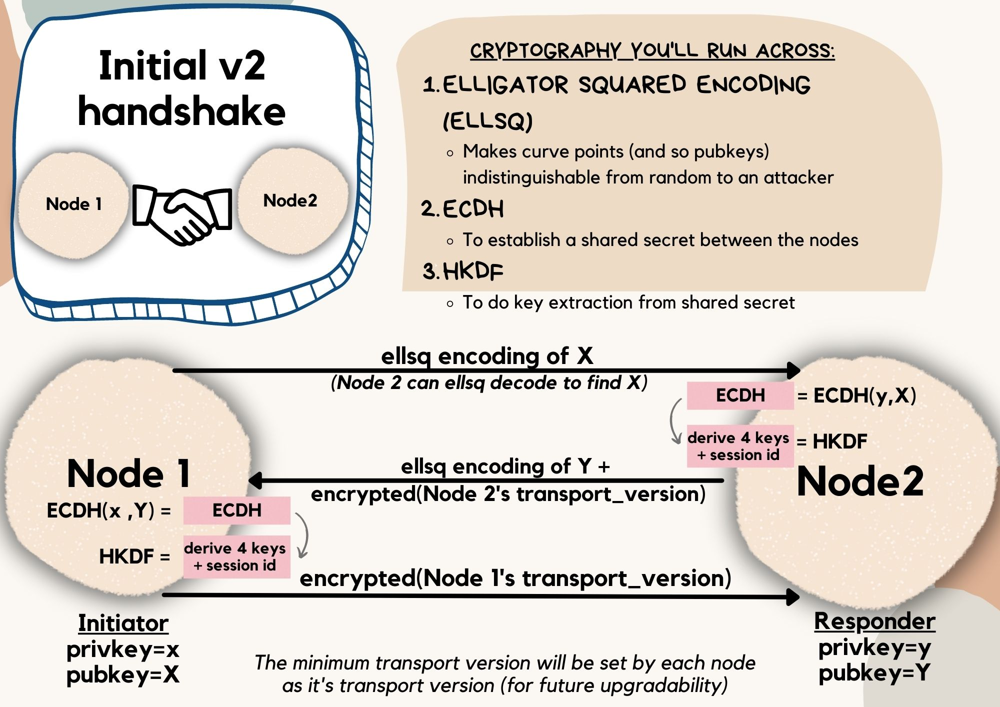
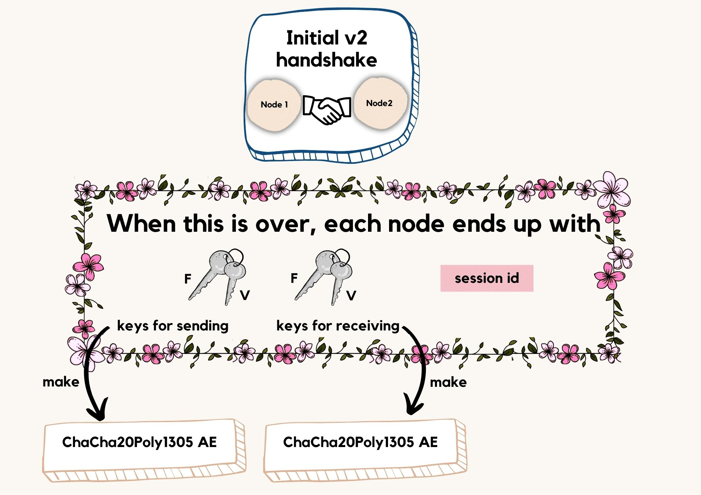
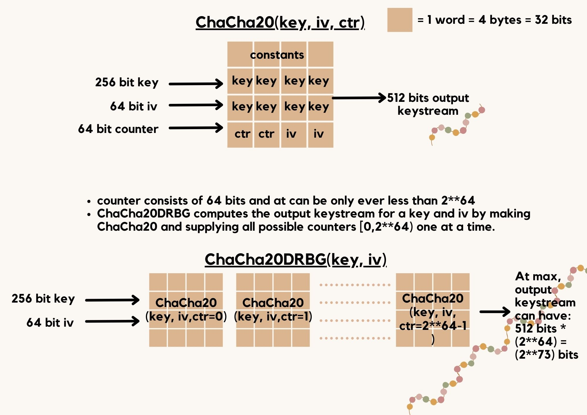
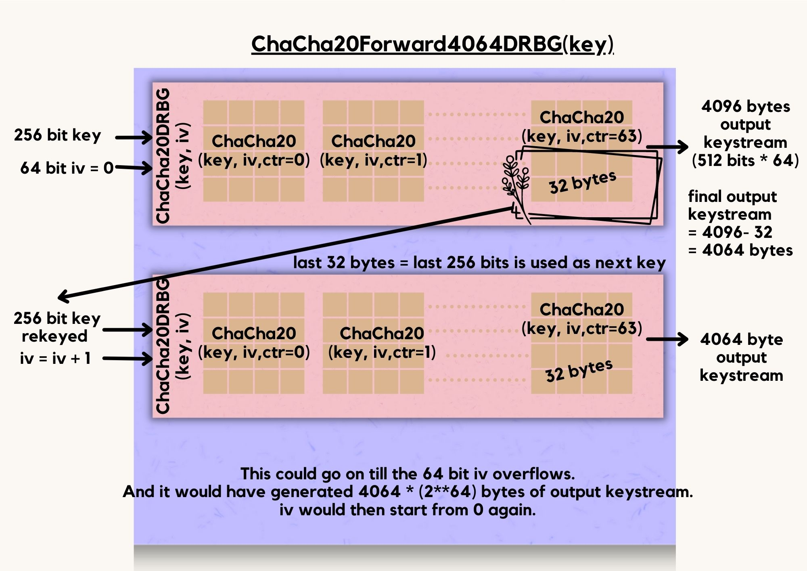
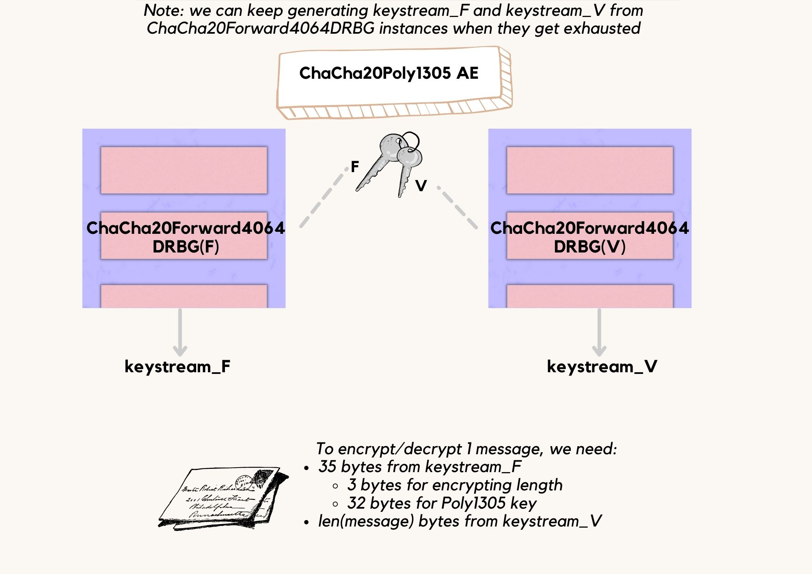
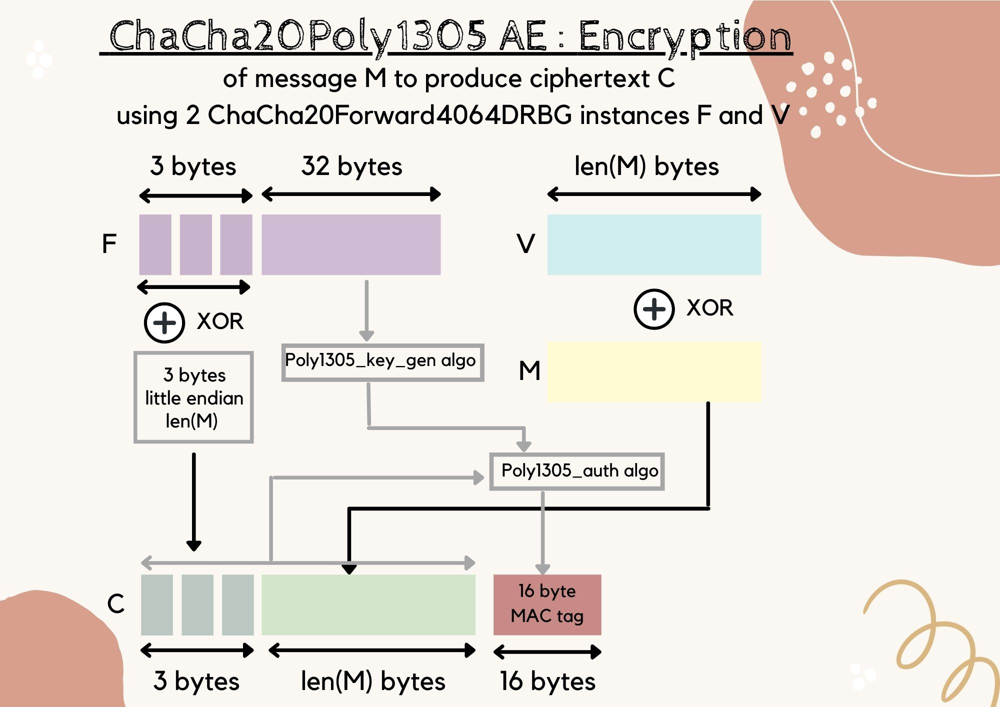
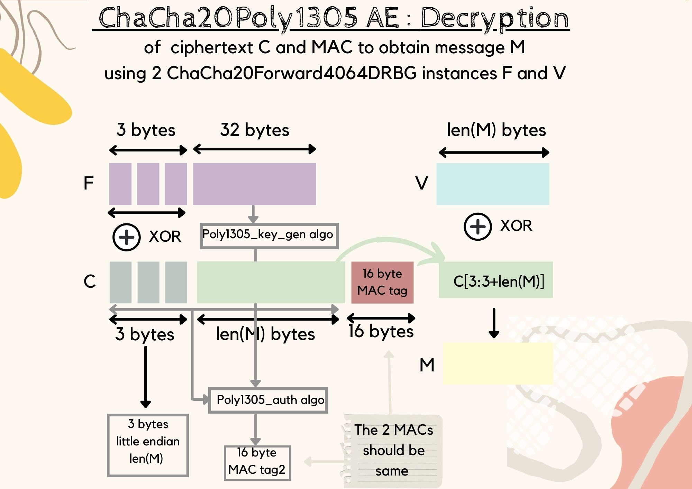
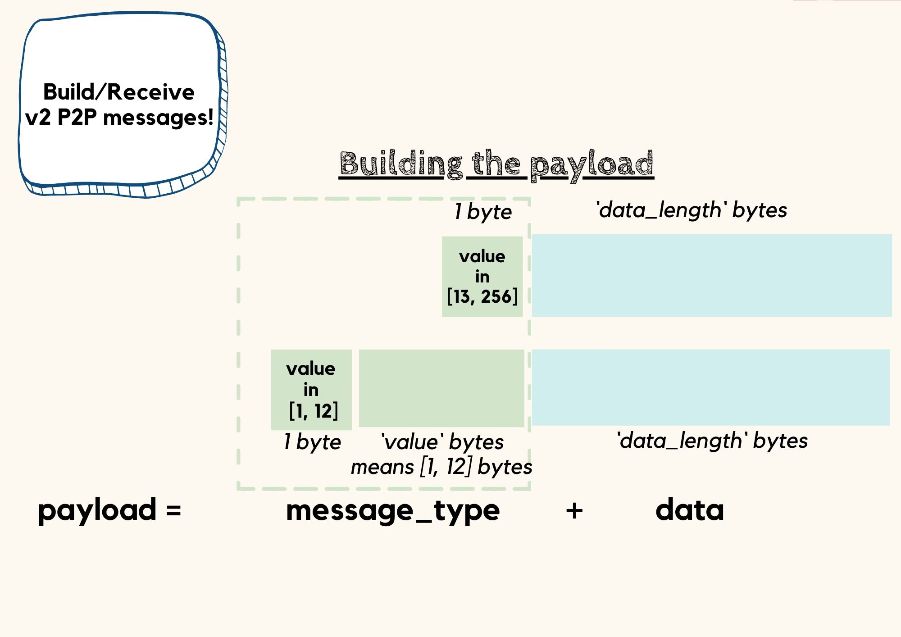
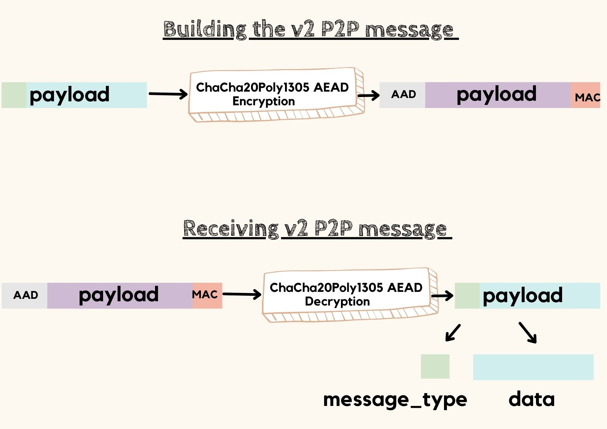

# How to encrypt the P2P protocol?
- Description: An ELI5 article explaining how BIP 324 works
- Date: 12/Feb/2022
- Author: [@stratospher](https://github.com/stratospher)
- **Index:**
  - [How can we encrypt the P2P protocol?](#how-can-we-encrypt-the-p2p-protocol)
  - [Step 1: The Initial v2 Handshake](#step-1-the-initial-v2-handshake)
  - [Step 2: ChaCha20Poly1305 AE specification](#step-2-chacha20poly1305-ae-specification)
    - [ChaCha20(key, iv, ctr)](#chacha20key-iv-ctr)
    - [ChaCha20DRBG(key, iv)](#chacha20drbgkey-iv)
    - [ChaCha20Forward4064DRBG(key)](#chacha20forward4064drbgkey)
    - [ChaCha20Poly1305 AE specification](#chacha20poly1305-ae-specification)
      - [Encryption](#encryption)
      - [Decryption](#decryption)
  - [Step 3: Build/Receive v2 P2P messages](#step-3-buildreceive-v2-p2p-messages)

In the bitcoin peer-to-peer network, nodes establish TCP connections to known peers and lots of different messages
like version, verack, getaddr etc. can be exchanged. Packet analyzers like [Wireshark](https://www.wireshark.org/docs/dfref/b/bitcoin.html)
can capture the TCP traffic and will be able to identify when the bitcoin protocol is being used in the packets.
Whoever controls the routing infrastructure of a network essentially controls the data flowing through the network.
If such individuals/organisations want to make it hard for normal users to run a bitcoin node, they'd ask the routers to
drop the bitcoin packets. To make bitcoin more censorship-resistant and easier to use for a normal user,
it's super important to encrypt the P2P communication.

## How can we encrypt the P2P protocol?

This can be visualised in 3 steps:
1. Initial v2 handshake
2. ChaCha20Poly1305 AE specification
3. Build/Receive v2 P2P messages

The answer boils down to the nodes (sender and receiver) having the same keystream. The sender node could encrypt 
and send `ciphertext = plaintext message xor keystream` and the receiver could receive and decrypt the message using 
`plaintext message = ciphertext xor keystream`. No one other than the sender and receiver would have any clue about 
what's in the packets. The receiver should also be able to know if the packet really comes from the sender.
This is what Step 2 and 3 deals with.

The sender and receiver nodes should have the keystream with them before any message is exchanged(even before the
version handshake). The big question becomes how do we obtain the keystream? Steps 1 and 2 will get us the keystream we
need. The initial v2 handshake in Step 1 will let only the sender and receiver nodes derive the same set of keys.
Step 2 makes use of a new cryptographic primitive which will let us derive as much keystream as we'd want
from those keys for encrypting/decrypting.

## Step 1: The Initial v2 Handshake

Suppose Node 1 and Node 2 want to communicate via v2 protocol. Before the handshake, each node would have its own
private key and public key.
1. Node 1 could send it's public key `X` over the TCP connection. But this would be easily identifiable
  as a secp256k1 curve point and would be suspected of running the bitcoin protocol.
    > the probability that 30 random observed transmission would always be valid X coordinates is less 
    than one in a billion.
    > 
    > -- <cite>[Elligator Squared for BN-like curves][1]</cite>

   [1]: https://github.com/sipa/writeups/tree/main/elligator-square-for-bn
2. So instead we send an Elligator squared encoding of `X` to Node 2 which makes the curve point indistinguishable from
  random to an observer.
3. Node 2 decodes and obtains `X`, uses `ECDH(y, X)` to establish a shared secret where `y` is its private key and then
  performs key extraction using HKDF to derive 2 keys for sending, 2 keys for receiving and a session id.
4. Node 2 sends an Elligator squared encoding of its public key `Y` along with its encrypted transport version to Node 1.
   (Encryption can be done now that we have the keys. Step 3's ChaCha20Poly1305 AE is used to derive the keystream.)
  Transport versioning is needed to add more upgrades like authentication and post-quantum cryptography in the future.
5. Node 1 decodes and obtains `Y`, computes `ECDH(x, Y)` and derives the 4 keys and the session id. The keys and the
   session id would be the same since the shared secret(`ECDH(y, X) = ECDH(x, Y)`) is the same.
6. Node 1 sends the encrypted transport version it supports to Node 2. The nodes communicate with the minimum
   transport version they both support.
   

## Step 2: ChaCha20Poly1305 AE specification

Before we get into what this powerful cryptographic primitive is, let's review and define other cryptographic
primitives which we'll use to build the ChaCha20Poly1305 AE specification.

*Note: In the diagrams below, overflow conditions for counter and iv are mentioned for academic interest. These
conditions are too huge and those many bytes won't be exchanged in practice.*

### ChaCha20(key, iv, ctr)
The ChaCha20 stream cipher takes as input:
1. 4 words constant
2. 8 words key
3. 2 words counter
4. 2 words iv

You can read more about ChaCha20 [here](https://voluntarymind.com/bitcoin/chacha20/).
After performing 20 ChaCha rounds, we can use the 512 pseudorandom bits as keystream.

### ChaCha20DRBG(key, iv)
`ChaCha20DRBG(key, iv)` is the cryptographic primitive we'd get if we concatenate the keystreams using all possible
values of counter [0, 2**64) in `ChaCha20(key, iv, ctr)`.

### ChaCha20Forward4064DRBG(key)

Suppose attackers learn the key in `ChaCha20DRBG(key, iv)`, it's possible for them to decrypt previous ciphertext.
`ChaCha20Forward4064DRBG(key)` prevents such a situation from happening.
1. We can get as much keystream as we want from `ChaCha20Forward4064DRBG(key)`. 
2. We know the initial key and iv is 0 in the beginning.
3. The keystream is made by concatenating `ChaCha20DRBG(key, iv)` instances where key and iv gets updated.
   After every 4064 bytes of generated keystream, the next 32 bytes is used as the new key, `key'`. So the next 4064
   bytes from the keystream is obtained using `ChaCha20DRBG(key', iv+1)`. And this process continues.

### ChaCha20Poly1305 AE specification

Remember how we obtained 4 keys in Step 1. A node uses 2 AEs - one for sending messages and another for receiving
messages. Each AE uses 2 keys:
1. F - for fixed length purposes. F requires 35 bytes - 3 bytes is used for encrypting/decrypting the length. Remaining
    32 bytes is used for instantiating a poly1305 key for authentication.
2. V - for variable length purposes. V is used for encrypting/decrypting the message.

`ChaCha20Forward4064DRBG(F)` and `ChaCha20Forward4064DRBG(V)` are constructed, and we can get `keystream_F` and 
`keystream_V` to perform encryption/decryption.

#### Encryption

The inputs are:
1. `keystream_F`
2. `keystream_V`
3. message to be encrypted

The output ciphertext obtained after encryption consists of 3 parts:
1. 3 bytes encrypted length - encrypted by performing xor operation on the length of message in little endian with the
   first 3 bytes from `keystream_F`.
2. variable bytes encrypted message - encrypted by performing xor operation on the message with `keystream_V`.
3. 16 bytes MAC tag - computed using the [Poly1305 algorithm](http://cr.yp.to/mac/poly1305-20050329.pdf).
   - Inputs to the Poly1305 Algorithm
     - 32-byte **one-time key** which is obtained from the next 32 bytes of `keystream_F`.
     - 3 bytes encrypted length and variable bytes encrypted message are passed as the message.
   - Output of the Poly1305 Algorithm
     - 16 bytes MAC tag.

#### Decryption

The inputs are:
1. ciphertext
2. `keystream_F`
3. `keystream_V`

The decryption process is just the reverse of the encryption process. An additional step performed is checking if the
MAC tag obtained directly from the ciphertext and the MAC tag calculated using the Poly1305 algorithm in the decryption
process are the same. The MAC tags will match if the message really came from the sender and has not been tampered with.

## Step 3: Build/Receive v2 P2P messages

v2 P2P protocol follows a different message structure. Messages here do not start with magic bytes.
P2P messages can be built in 2 stages:
1. Building/Deconstructing the payload
2. Encrypting/Decrypting it using ChaCha20Poly1305 AE. Messages are now ready to be sent/read!

### Building/Deconstructing the payload

The payload consists of the message type and the data to be sent. The message type can be a 1 byte message type ID.
For example, version message has a message type ID of 37. *(See the BIP for full list.)* 
Message type IDs can be values in the range 13 to 255.

Or the message type can consist of:
1. 1 byte denoting length of message type - this can have a value from 1 to 12
2. 1-12 bytes describing the ASCII message type
In total, the message type can have 2-13 bytes.

### Encrypting/Decrypting it using ChaCha20Poly1305 AE

The v2 P2P messages are encrypted using the ChaCha20Poly1305 AE. Messages can now be sent over the
TCP connection. Reverse process is applied after receiving a message. Decryption is done using ChaCha20Poly1305 AE.
The message type and data is obtained.
