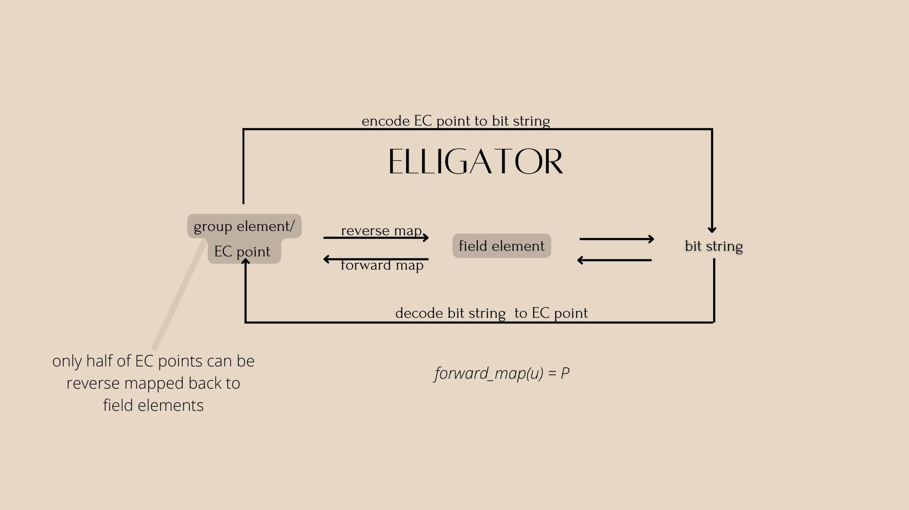
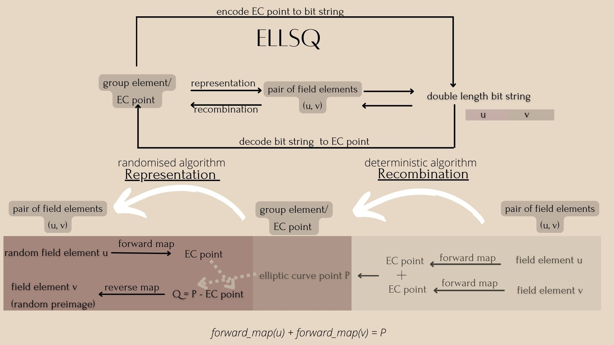
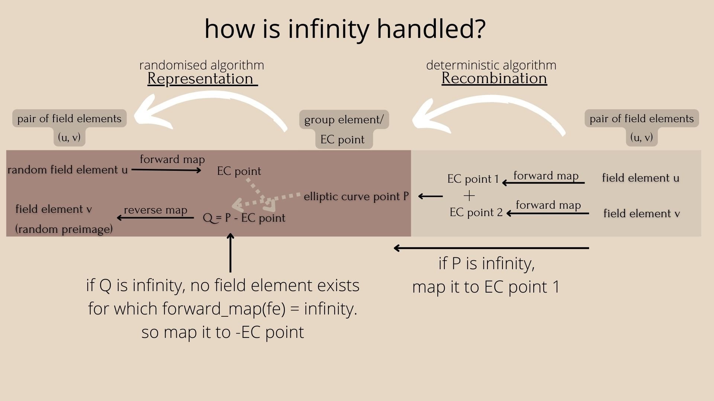

# Elligators
- Description: Elligator, Elligator Squared and Elligator Swift
- Date: 5/Aug/2022
- Author: [@stratospher](https://github.com/stratospher)
- **Index:**
    - [Need](#need)
    - [History](#history)
    - [Introduction](#introduction)
    - [Elligator](#elligator)
    - [Elligator Squared](#elligator-squared)
    - [Elligator Swift](#elligator-swift)
    - [References](#references)

## Need
Elliptic curve points need to achieve a form of steganography for censorship circumvention. Network traffic containing
points on elliptic curves(e.g. public keys for encryption or signature) when represented in the usual way can be easily
distinguished from random. This may lead to automated traffic interruption or targeted surveillance. So we need a way to
represent a uniform point on E(Fq) as a uniform random bit string.

## History
There is a ton of work done in this area for the construction of deterministic maps from a field to points on curve
over that field. We're only touching on a very few constructions in this post. Schinzel and Skałba gave the first
deterministic method of constructing rational points on elliptic curves. Shallue and van de Woestijne generalize and
simplify Skałba’s construction, giving concretely efficient rational maps to essentially any elliptic curve.
But it's still very costly.

## Introduction
Elligator, Elligator Squared and Elligator Swift consists of mapping function(forward, reverse) which map field elements
to a group element and vice versa. They form forward maps and reverse maps respectively. Examples include: Elligator 1
map, Elligator 2 map, Shallue–van de Woestijne encoding etc.. The constructions make use of the maps to encode elliptic
curve points to bit strings and vice versa.

## Elligator

There are 2 different mapping functions - Elligator 1 and Elligator 2 that can be used in this construction.
However, Elligator 1 is less widely applicable.

* Curve requirements:
    - Elligator 1:
      - Edwards curves E(Fq), q ≡ 3 mod 4
    - Elligator 2:
      - Any curve with a point of order 2 (means P + P = infinity point)
      - and any odd q (smallest positive integer such that (P+P+.. = infinity point) must be odd)
    - secp256k1 does not satisfy curve requirements:
        - secp256k1 cannot be expressed as a Montgomery curve(y**2 = x**3 +Ax**2 +Bx)
        - Montgomery curve necessarily contains the point (0,0) which has order 2

* Works on only subset of points
    - only half of EC points can be reverse mapped back to field elements
    - because the reverse map is defined only for points on the curve which satisfy:
    - y**2 = x**3 +Ax**2 +Bx
    - (x,y) ∈ E(Fq) such that
        1. x ≠ −A
        2. if y=0 then x=0
        3. −ux(x+A) is a square in Fq

* Disadvantage
    - only subset of elliptic curve points can be encoded as strings
    - cannot be used with prime-order curves

## Elligator Squared

* Curve requirements:
    -  any elliptic curve
* Works on any points
* Mapping:
    - choose mapping functions whose preimages are efficiently computable
    - for secp256k1(a BN curve), Shallue-van de Woestijne mapping function can be used
    - forward map
        -  f : Fq → E(Fq)
        - every field element is mapped to curve point
        - significant fraction of curve points are reachable (not all - 9/16th curve points reached)
        - at most 4 field elements map to a curve point
    - reverse map
        - r : E(Fq) → Fq
        - given point P, find a field element u such that forward_map(u) = P
        - find all the preimages of P − f (v)
        - here are at most 4 such preimages.
        Then pick i ∈ {1, 2, 3, 4} at random and return the i-th preimage if it exists. Otherwise, start over with another v.
    - read more about the Shallue-van de Woestijne mapping function [here](./shallue-van-de-woestijne.md).

* Construction:
    - Representation (curve point -> fe, fe)
        - E(Fq) → F²q
        - randomised algorithm
        - given EC point P, we want to find 2 field elements u and v such that:
            forward_map(u) + forward_map(v) = P
        - Steps:
            1. generate a random field element u
            2. compute point Q = P - forward_map(u)
            3. v = reverse_map(Q)
            4. return u, v
    - Recombination (fe, fe -> curve point)
        - F²q → E(Fq)
        - deterministic algorithm
        - given 2 field elements u and v, we want to find curve point P
        - just do forward_map(u) + forward_map(v) = P

* in secp256k1, field elements can be encoded as bytes directly and concatenated since field size is close to power of 2.
* math proof: [link](./shallue-van-de-woestijne.md)
* python code: [link](https://github.com/stratospher/python-cryptography/blob/master/ellsq.py)

###  How is infinity handled in Elligator Squared?
* we need to handle infinity to make sure every input (u,v) can be decoded to an elliptic curve point P.
* so we remap it to another point.

* Advantage:
    - All elliptic curve points are representable
    - Bit string representation of a random point on the whole elliptic curve
    - No need for repeatedly restarting the protocol until a representable point is found (unlike Elligator)
    - Encoding function f which we use exists for essentially all elliptic curves
    - More efficient than Elligator for representing generated points as bit strings
* Disadvantage:
    - Encoding output is about twice as long as Elligator
    - Recombination algorithm about twice as slow (2 forward maps)
    - Representation function is also somewhat more complicated and costly than that of Elligator. (multiple iterations,
      each of them evaluating the function f when rejection sampling done, that is if we don't get v in reverse_map)

## Elligator Swift

* curve requirements
    - all curves over fields Fq with q ≡ 1 (mod 3) 
    - almost all elliptic curves in current use

* Mapping and Construction:
    - forward map
      - fully computing the underlying encoding in the forward direction becomes unnecessary saving many field exponentiations in the process.
      - TODO:
    - reverse map

* math proof: [link](./swiftEC.md)
* python code: [link](https://github.com/stratospher/python-cryptography/blob/master/ellswift.py)
    
* Advantage:
    - indifferentiable hashing to most curves with a single exponentiation.
    - much faster than Elligator Square itself, as it requires far fewer field exponentiations on average.
* Disadvantage:
    - a single-square root admissible encoding that could be applied to all ordinary elliptic curves?
    - more workarounds to extend this encoding to more of the non-compatible curves 

## References
Elligator:
1. https://elligator.cr.yp.to
2. https://elligator.org

Elligator Squared:
1. https://github.com/sipa/writeups/tree/main/elligator-square-for-bn
2. https://eprint.iacr.org/2014/043.pdf
3. https://www.di.ens.fr/~fouque/pub/latincrypt12.pdf

Elligator Swift:
1. https://eprint.iacr.org/2022/759.pdf

History:
1. https://tches.iacr.org/index.php/TCHES/article/view/8348/7697