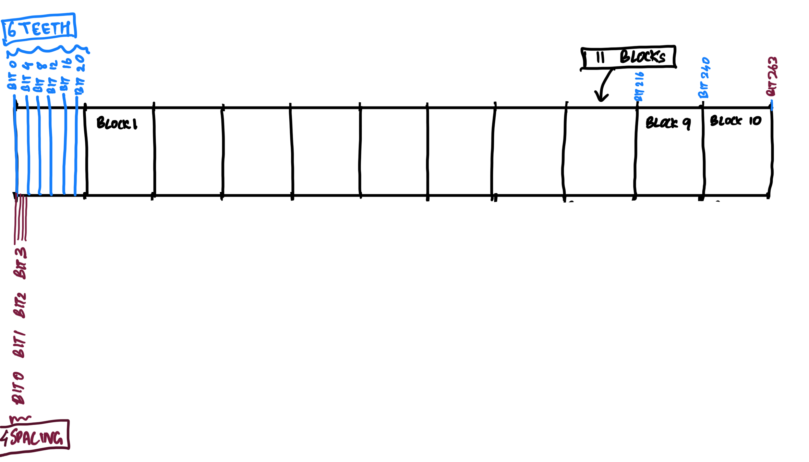
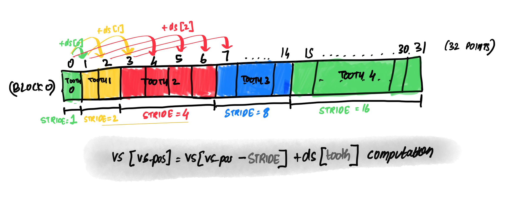

# Signed-digit multi-comb ecmult_gen algorithm
- Description: https://github.com/bitcoin-core/secp256k1/pull/1058
- Date: 20/April/2024

## intro

- we want to compute [`R = gn*G = (gn - b)*G + b*G`](https://github.com/bitcoin-core/secp256k1/blob/4c341f89ab704205a89b5c5d404ed60f381f7c48/src/ecmult_gen_impl.h#L68) where `G` is the generator point, `gn` is a scalar and `b` is a scalar used to blind the multiplication
- there's a [`comb(d, G/2)` formula](https://github.com/bitcoin-core/secp256k1/blob/4c341f89ab704205a89b5c5d404ed60f381f7c48/src/ecmult_gen_impl.h#L95) to compute `(gn - b)*G` and to express it as sum of +,- powers of 2 multiplied by `G/2`
- supposing we have a precomputed table where possible sums of +, - powers of 2 multiplied by `G/2` is stored,
we can compute `(gn - b)*G` by picking the terms we want and then summing them. this is a cheaper operation than multiplication.
- we can implement `R = gn*G` with a method to compute and access this precomputed table.
- definition: block, teeth, spacing refer to group of bits in a scalar and looks like:

## [`secp256k1_ecmult_gen`](https://github.com/bitcoin-core/secp256k1/blob/4c341f89ab704205a89b5c5d404ed60f381f7c48/src/ecmult_gen_impl.h#L54): accessing the precomputed table

```
comb(d, G/2) = sum((2*d_i-1)*2^i*G/2 for i=0..263)
             = (+- 2^0 +- 2^1 +- 2^2 +- 2^3 ............ +- 2^261 +- 2^262 +- 2^263) * G/2
             = ((+- 2^0 +- 2^4 ..... +- 2^260) + (+- 2^1 +- 2^5 ..... +- 2^261) + (+- 2^2 +- 2^6 ..... +- 2^262) + (+- 2^3 +- 2^7 ..... +- 2^263)) *G/2
```
- all possible combinations of `(+- 2^0 +- 2^4 ..... +- 2^240)` is pre-computed and stored in a table.
- example: for default configuration with blocks = 11, teeth = 6 when spacing = 0, table would look like:

|         | 00000					                                | 00001					                                | ....	 | 11111                                     |
|---------|-------------------------------------------|-------------------------------------------|-------|-------------------------------------------|
| block0  | -2^20 -2^16 -2^12 -2^8 -2^4 -2^0          | -2^20 -2^16 -2^12 -2^8 -2^4 +2^0	         | ....	 | -2^20 +2^16 +2^12 +2^8 +2^4 +2^0          |
| ...     | ...                                       | ...                                       | ...   | ...                                       |
| block10 | -2^260 -2^256 -2^252 -2^248 -2^244 -2^240 | -2^260 -2^256 -2^252 -2^248 -2^244 +2^240 | ...   | -2^260 +2^256 +2^252 +2^248 +2^244 +2^240 |

- since there are 6 teeth here, each block would have 2^6 possibilities of + and -
  - 101010 would mean `+2^20 -2^16 +2^12 -2^8 +2^4 -2^0` multiplied by G/2
  - since result of 101010 is negation of result of 010101, the precomputed table only needs to store half the values.
  - precomputed table keeps first bit as 0 in the table -> so there's 2**5 possibilities of + and - now.
  - so we'd look up value for 010101 at index = 10101 and negate the result
  
- similarly, another table for spacing = 1 and all possible combinations of `(+- 2^1 +- 2^5 ..... +- 2^261)`. we'd have 4 different tables in total for this example because spacing = 4.

## [`secp256k1_ecmult_gen_compute_table`](https://github.com/bitcoin-core/secp256k1/blob/4c341f89ab704205a89b5c5d404ed60f381f7c48/src/ecmult_gen_compute_table_impl.h#L17) : precomputing the table

- consider block 0:
  - the index 0 in precomputed table stores `-2^20 -2^16 -2^12 -2^8 -2^4 -2^0`
  - `ds[0..5]` stores [`2 * 2^0`,  `2 * 2^4`, `2 * 2^8`, `2 * 2^12`, `2 * 2^16`, `2 * 2^20`]
  - the rest of the values in the row is this value with different combination of +, - signs.
  <details><summary>they can be computed by adding/not adding the various values in ds[0..5]</summary>

  ```
  ds[0] = 2  * (2 ^ (block * teeth * spacing)) * gen/2
  ds[1] = 2  * (2 ^ (block * teeth * spacing)) * (2 ^ spacing) * gen/2
  ds[2] = 2  * (2 ^ (block * teeth * spacing)) * (2 ^ 2*spacing) gen/2
  ds[3] = 2  * (2 ^ (block * teeth * spacing)) * (2 ^ 3*spacing) gen/2
  ds[4] = 2  * (2 ^ (block * teeth * spacing)) * (2 ^ 4*spacing) gen/2
  ds[5] = 2  * (2 ^ (block * teeth * spacing)) * (2 ^ 5*spacing) gen/2
  
  vs[0] = - (2 ^ (block * teeth * spacing))
  - (2 ^ (block * teeth * spacing)) * (2 ^ spacing)
  - (2 ^ (block * teeth * spacing)) * (2 ^ 2*spacing)
  - (2 ^ (block * teeth * spacing)) * (2 ^ 3*spacing)
  ...
  - (2 ^ (block * teeth * spacing)) * (2 ^ (teeth-3)*spacing)
  - (2 ^ (block * teeth * spacing)) * (2 ^ (teeth-2)*spacing)
  - (2 ^ (block * teeth * spacing)) * (2 ^ (teeth-1)*spacing)
  
  vs[1] = vs[0] + ds[0]
  vs[1] = + (2 ^ (block * teeth * spacing))
  - (2 ^ (block * teeth * spacing)) * (2 ^ spacing)
  - (2 ^ (block * teeth * spacing)) * (2 ^ 2*spacing)
  - (2 ^ (block * teeth * spacing)) * (2 ^ 3*spacing)
  ...
  - (2 ^ (block * teeth * spacing)) * (2 ^ (teeth-3)*spacing)
  - (2 ^ (block * teeth * spacing)) * (2 ^ (teeth-2)*spacing)
  - (2 ^ (block * teeth * spacing)) * (2 ^ (teeth-1)*spacing)
  
  vs[2] = vs[0] + ds[1]
  vs[2] = - (2 ^ (block * teeth * spacing))
  + (2 ^ (block * teeth * spacing)) * (2 ^ spacing)
  - (2 ^ (block * teeth * spacing)) * (2 ^ 2*spacing)
  - (2 ^ (block * teeth * spacing)) * (2 ^ 3*spacing)
  ...
  - (2 ^ (block * teeth * spacing)) * (2 ^ (teeth-3)*spacing)
  - (2 ^ (block * teeth * spacing)) * (2 ^ (teeth-2)*spacing)
  - (2 ^ (block * teeth * spacing)) * (2 ^ (teeth-1)*spacing)
  ```
  
    </details>

  - we don't really need to store ds[5] since it's unused (we're only computing half table since the other half is a negation).
    - how much can we save anyways? 10 blocks * 4 tables * sizeof(secp256k1_gej) = 40 * 152 ~ 6 kb
- see human understandable version of full table for spacing = 0 in a default configuration with blocks = 11, teeth = 6, spacing = 4


|          | 00000                                     | 00001                                     | 00010                                     | 00011                                     | 00100                                     | 00101                                     | 00110                                     | 00111                                     | 01000                                     | 01001                                     | 01010                                     | 01011                                     | 01100                                     | 01101                                     | 01110                                     | 01111                                     | 10000                                     | 10001                                     | 10010                                     | 10011                                     | 10100                                     | 10101                                     | 10110                                     | 10111                                     | 11000                                     | 11001                                     | 11010                                     | 11011                                     | 11100                                     | 11101                                     | 11110                                     | 11111                                     |
|----------|-------------------------------------------|-------------------------------------------|-------------------------------------------|-------------------------------------------|-------------------------------------------|-------------------------------------------|-------------------------------------------|-------------------------------------------|-------------------------------------------|-------------------------------------------|-------------------------------------------|-------------------------------------------|-------------------------------------------|-------------------------------------------|-------------------------------------------|-------------------------------------------|-------------------------------------------|-------------------------------------------|-------------------------------------------|-------------------------------------------|-------------------------------------------|-------------------------------------------|-------------------------------------------|-------------------------------------------|-------------------------------------------|-------------------------------------------|-------------------------------------------|-------------------------------------------|-------------------------------------------|-------------------------------------------|-------------------------------------------|-------------------------------------------|
| block 0  | -2^20 -2^16 -2^12 -2^8 -2^4 -2^0          | -2^20 -2^16 -2^12 -2^8 -2^4 +2^0          | -2^20 -2^16 -2^12 -2^8 +2^4 -2^0          | -2^20 -2^16 -2^12 -2^8 +2^4 +2^0          | -2^20 -2^16 -2^12 +2^8 -2^4 -2^0          | -2^20 -2^16 -2^12 +2^8 -2^4 +2^0          | -2^20 -2^16 -2^12 +2^8 +2^4 -2^0          | -2^20 -2^16 -2^12 +2^8 +2^4 +2^0          | -2^20 -2^16 +2^12 -2^8 -2^4 -2^0          | -2^20 -2^16 +2^12 -2^8 -2^4 +2^0          | -2^20 -2^16 +2^12 -2^8 +2^4 -2^0          | -2^20 -2^16 +2^12 -2^8 +2^4 +2^0          | -2^20 -2^16 +2^12 +2^8 -2^4 -2^0          | -2^20 -2^16 +2^12 +2^8 -2^4 +2^0          | -2^20 -2^16 +2^12 +2^8 +2^4 -2^0          | -2^20 -2^16 +2^12 +2^8 +2^4 +2^0          | -2^20 +2^16 -2^12 -2^8 -2^4 -2^0          | -2^20 +2^16 -2^12 -2^8 -2^4 +2^0          | -2^20 +2^16 -2^12 -2^8 +2^4 -2^0          | -2^20 +2^16 -2^12 -2^8 +2^4 +2^0          | -2^20 +2^16 -2^12 +2^8 -2^4 -2^0          | -2^20 +2^16 -2^12 +2^8 -2^4 +2^0          | -2^20 +2^16 -2^12 +2^8 +2^4 -2^0          | -2^20 +2^16 -2^12 +2^8 +2^4 +2^0          | -2^20 +2^16 +2^12 -2^8 -2^4 -2^0          | -2^20 +2^16 +2^12 -2^8 -2^4 +2^0          | -2^20 +2^16 +2^12 -2^8 +2^4 -2^0          | -2^20 +2^16 +2^12 -2^8 +2^4 +2^0          | -2^20 +2^16 +2^12 +2^8 -2^4 -2^0          | -2^20 +2^16 +2^12 +2^8 -2^4 +2^0          | -2^20 +2^16 +2^12 +2^8 +2^4 -2^0          | -2^20 +2^16 +2^12 +2^8 +2^4 +2^0          |
| block 1  | -2^44 -2^40 -2^36 -2^32 -2^28 -2^24       | -2^44 -2^40 -2^36 -2^32 -2^28 +2^24       | -2^44 -2^40 -2^36 -2^32 +2^28 -2^24       | -2^44 -2^40 -2^36 -2^32 +2^28 +2^24       | -2^44 -2^40 -2^36 +2^32 -2^28 -2^24       | -2^44 -2^40 -2^36 +2^32 -2^28 +2^24       | -2^44 -2^40 -2^36 +2^32 +2^28 -2^24       | -2^44 -2^40 -2^36 +2^32 +2^28 +2^24       | -2^44 -2^40 +2^36 -2^32 -2^28 -2^24       | -2^44 -2^40 +2^36 -2^32 -2^28 +2^24       | -2^44 -2^40 +2^36 -2^32 +2^28 -2^24       | -2^44 -2^40 +2^36 -2^32 +2^28 +2^24       | -2^44 -2^40 +2^36 +2^32 -2^28 -2^24       | -2^44 -2^40 +2^36 +2^32 -2^28 +2^24       | -2^44 -2^40 +2^36 +2^32 +2^28 -2^24       | -2^44 -2^40 +2^36 +2^32 +2^28 +2^24       | -2^44 +2^40 -2^36 -2^32 -2^28 -2^24       | -2^44 +2^40 -2^36 -2^32 -2^28 +2^24       | -2^44 +2^40 -2^36 -2^32 +2^28 -2^24       | -2^44 +2^40 -2^36 -2^32 +2^28 +2^24       | -2^44 +2^40 -2^36 +2^32 -2^28 -2^24       | -2^44 +2^40 -2^36 +2^32 -2^28 +2^24       | -2^44 +2^40 -2^36 +2^32 +2^28 -2^24       | -2^44 +2^40 -2^36 +2^32 +2^28 +2^24       | -2^44 +2^40 +2^36 -2^32 -2^28 -2^24       | -2^44 +2^40 +2^36 -2^32 -2^28 +2^24       | -2^44 +2^40 +2^36 -2^32 +2^28 -2^24       | -2^44 +2^40 +2^36 -2^32 +2^28 +2^24       | -2^44 +2^40 +2^36 +2^32 -2^28 -2^24       | -2^44 +2^40 +2^36 +2^32 -2^28 +2^24       | -2^44 +2^40 +2^36 +2^32 +2^28 -2^24       | -2^44 +2^40 +2^36 +2^32 +2^28 +2^24       |
| block 2  | -2^68 -2^64 -2^60 -2^56 -2^52 -2^48       | -2^68 -2^64 -2^60 -2^56 -2^52 +2^48       | -2^68 -2^64 -2^60 -2^56 +2^52 -2^48       | -2^68 -2^64 -2^60 -2^56 +2^52 +2^48       | -2^68 -2^64 -2^60 +2^56 -2^52 -2^48       | -2^68 -2^64 -2^60 +2^56 -2^52 +2^48       | -2^68 -2^64 -2^60 +2^56 +2^52 -2^48       | -2^68 -2^64 -2^60 +2^56 +2^52 +2^48       | -2^68 -2^64 +2^60 -2^56 -2^52 -2^48       | -2^68 -2^64 +2^60 -2^56 -2^52 +2^48       | -2^68 -2^64 +2^60 -2^56 +2^52 -2^48       | -2^68 -2^64 +2^60 -2^56 +2^52 +2^48       | -2^68 -2^64 +2^60 +2^56 -2^52 -2^48       | -2^68 -2^64 +2^60 +2^56 -2^52 +2^48       | -2^68 -2^64 +2^60 +2^56 +2^52 -2^48       | -2^68 -2^64 +2^60 +2^56 +2^52 +2^48       | -2^68 +2^64 -2^60 -2^56 -2^52 -2^48       | -2^68 +2^64 -2^60 -2^56 -2^52 +2^48       | -2^68 +2^64 -2^60 -2^56 +2^52 -2^48       | -2^68 +2^64 -2^60 -2^56 +2^52 +2^48       | -2^68 +2^64 -2^60 +2^56 -2^52 -2^48       | -2^68 +2^64 -2^60 +2^56 -2^52 +2^48       | -2^68 +2^64 -2^60 +2^56 +2^52 -2^48       | -2^68 +2^64 -2^60 +2^56 +2^52 +2^48       | -2^68 +2^64 +2^60 -2^56 -2^52 -2^48       | -2^68 +2^64 +2^60 -2^56 -2^52 +2^48       | -2^68 +2^64 +2^60 -2^56 +2^52 -2^48       | -2^68 +2^64 +2^60 -2^56 +2^52 +2^48       | -2^68 +2^64 +2^60 +2^56 -2^52 -2^48       | -2^68 +2^64 +2^60 +2^56 -2^52 +2^48       | -2^68 +2^64 +2^60 +2^56 +2^52 -2^48       | -2^68 +2^64 +2^60 +2^56 +2^52 +2^48       |
| block 3  | -2^92 -2^88 -2^84 -2^80 -2^76 -2^72       | -2^92 -2^88 -2^84 -2^80 -2^76 +2^72       | -2^92 -2^88 -2^84 -2^80 +2^76 -2^72       | -2^92 -2^88 -2^84 -2^80 +2^76 +2^72       | -2^92 -2^88 -2^84 +2^80 -2^76 -2^72       | -2^92 -2^88 -2^84 +2^80 -2^76 +2^72       | -2^92 -2^88 -2^84 +2^80 +2^76 -2^72       | -2^92 -2^88 -2^84 +2^80 +2^76 +2^72       | -2^92 -2^88 +2^84 -2^80 -2^76 -2^72       | -2^92 -2^88 +2^84 -2^80 -2^76 +2^72       | -2^92 -2^88 +2^84 -2^80 +2^76 -2^72       | -2^92 -2^88 +2^84 -2^80 +2^76 +2^72       | -2^92 -2^88 +2^84 +2^80 -2^76 -2^72       | -2^92 -2^88 +2^84 +2^80 -2^76 +2^72       | -2^92 -2^88 +2^84 +2^80 +2^76 -2^72       | -2^92 -2^88 +2^84 +2^80 +2^76 +2^72       | -2^92 +2^88 -2^84 -2^80 -2^76 -2^72       | -2^92 +2^88 -2^84 -2^80 -2^76 +2^72       | -2^92 +2^88 -2^84 -2^80 +2^76 -2^72       | -2^92 +2^88 -2^84 -2^80 +2^76 +2^72       | -2^92 +2^88 -2^84 +2^80 -2^76 -2^72       | -2^92 +2^88 -2^84 +2^80 -2^76 +2^72       | -2^92 +2^88 -2^84 +2^80 +2^76 -2^72       | -2^92 +2^88 -2^84 +2^80 +2^76 +2^72       | -2^92 +2^88 +2^84 -2^80 -2^76 -2^72       | -2^92 +2^88 +2^84 -2^80 -2^76 +2^72       | -2^92 +2^88 +2^84 -2^80 +2^76 -2^72       | -2^92 +2^88 +2^84 -2^80 +2^76 +2^72       | -2^92 +2^88 +2^84 +2^80 -2^76 -2^72       | -2^92 +2^88 +2^84 +2^80 -2^76 +2^72       | -2^92 +2^88 +2^84 +2^80 +2^76 -2^72       | -2^92 +2^88 +2^84 +2^80 +2^76 +2^72       |
| block 4  | -2^116 -2^112 -2^108 -2^104 -2^100 -2^96  | -2^116 -2^112 -2^108 -2^104 -2^100 +2^96  | -2^116 -2^112 -2^108 -2^104 +2^100 -2^96  | -2^116 -2^112 -2^108 -2^104 +2^100 +2^96  | -2^116 -2^112 -2^108 +2^104 -2^100 -2^96  | -2^116 -2^112 -2^108 +2^104 -2^100 +2^96  | -2^116 -2^112 -2^108 +2^104 +2^100 -2^96  | -2^116 -2^112 -2^108 +2^104 +2^100 +2^96  | -2^116 -2^112 +2^108 -2^104 -2^100 -2^96  | -2^116 -2^112 +2^108 -2^104 -2^100 +2^96  | -2^116 -2^112 +2^108 -2^104 +2^100 -2^96  | -2^116 -2^112 +2^108 -2^104 +2^100 +2^96  | -2^116 -2^112 +2^108 +2^104 -2^100 -2^96  | -2^116 -2^112 +2^108 +2^104 -2^100 +2^96  | -2^116 -2^112 +2^108 +2^104 +2^100 -2^96  | -2^116 -2^112 +2^108 +2^104 +2^100 +2^96  | -2^116 +2^112 -2^108 -2^104 -2^100 -2^96  | -2^116 +2^112 -2^108 -2^104 -2^100 +2^96  | -2^116 +2^112 -2^108 -2^104 +2^100 -2^96  | -2^116 +2^112 -2^108 -2^104 +2^100 +2^96  | -2^116 +2^112 -2^108 +2^104 -2^100 -2^96  | -2^116 +2^112 -2^108 +2^104 -2^100 +2^96  | -2^116 +2^112 -2^108 +2^104 +2^100 -2^96  | -2^116 +2^112 -2^108 +2^104 +2^100 +2^96  | -2^116 +2^112 +2^108 -2^104 -2^100 -2^96  | -2^116 +2^112 +2^108 -2^104 -2^100 +2^96  | -2^116 +2^112 +2^108 -2^104 +2^100 -2^96  | -2^116 +2^112 +2^108 -2^104 +2^100 +2^96  | -2^116 +2^112 +2^108 +2^104 -2^100 -2^96  | -2^116 +2^112 +2^108 +2^104 -2^100 +2^96  | -2^116 +2^112 +2^108 +2^104 +2^100 -2^96  | -2^116 +2^112 +2^108 +2^104 +2^100 +2^96  |
| block 5  | -2^140 -2^136 -2^132 -2^128 -2^124 -2^120 | -2^140 -2^136 -2^132 -2^128 -2^124 +2^120 | -2^140 -2^136 -2^132 -2^128 +2^124 -2^120 | -2^140 -2^136 -2^132 -2^128 +2^124 +2^120 | -2^140 -2^136 -2^132 +2^128 -2^124 -2^120 | -2^140 -2^136 -2^132 +2^128 -2^124 +2^120 | -2^140 -2^136 -2^132 +2^128 +2^124 -2^120 | -2^140 -2^136 -2^132 +2^128 +2^124 +2^120 | -2^140 -2^136 +2^132 -2^128 -2^124 -2^120 | -2^140 -2^136 +2^132 -2^128 -2^124 +2^120 | -2^140 -2^136 +2^132 -2^128 +2^124 -2^120 | -2^140 -2^136 +2^132 -2^128 +2^124 +2^120 | -2^140 -2^136 +2^132 +2^128 -2^124 -2^120 | -2^140 -2^136 +2^132 +2^128 -2^124 +2^120 | -2^140 -2^136 +2^132 +2^128 +2^124 -2^120 | -2^140 -2^136 +2^132 +2^128 +2^124 +2^120 | -2^140 +2^136 -2^132 -2^128 -2^124 -2^120 | -2^140 +2^136 -2^132 -2^128 -2^124 +2^120 | -2^140 +2^136 -2^132 -2^128 +2^124 -2^120 | -2^140 +2^136 -2^132 -2^128 +2^124 +2^120 | -2^140 +2^136 -2^132 +2^128 -2^124 -2^120 | -2^140 +2^136 -2^132 +2^128 -2^124 +2^120 | -2^140 +2^136 -2^132 +2^128 +2^124 -2^120 | -2^140 +2^136 -2^132 +2^128 +2^124 +2^120 | -2^140 +2^136 +2^132 -2^128 -2^124 -2^120 | -2^140 +2^136 +2^132 -2^128 -2^124 +2^120 | -2^140 +2^136 +2^132 -2^128 +2^124 -2^120 | -2^140 +2^136 +2^132 -2^128 +2^124 +2^120 | -2^140 +2^136 +2^132 +2^128 -2^124 -2^120 | -2^140 +2^136 +2^132 +2^128 -2^124 +2^120 | -2^140 +2^136 +2^132 +2^128 +2^124 -2^120 | -2^140 +2^136 +2^132 +2^128 +2^124 +2^120 |
| block 6  | -2^164 -2^160 -2^156 -2^152 -2^148 -2^144 | -2^164 -2^160 -2^156 -2^152 -2^148 +2^144 | -2^164 -2^160 -2^156 -2^152 +2^148 -2^144 | -2^164 -2^160 -2^156 -2^152 +2^148 +2^144 | -2^164 -2^160 -2^156 +2^152 -2^148 -2^144 | -2^164 -2^160 -2^156 +2^152 -2^148 +2^144 | -2^164 -2^160 -2^156 +2^152 +2^148 -2^144 | -2^164 -2^160 -2^156 +2^152 +2^148 +2^144 | -2^164 -2^160 +2^156 -2^152 -2^148 -2^144 | -2^164 -2^160 +2^156 -2^152 -2^148 +2^144 | -2^164 -2^160 +2^156 -2^152 +2^148 -2^144 | -2^164 -2^160 +2^156 -2^152 +2^148 +2^144 | -2^164 -2^160 +2^156 +2^152 -2^148 -2^144 | -2^164 -2^160 +2^156 +2^152 -2^148 +2^144 | -2^164 -2^160 +2^156 +2^152 +2^148 -2^144 | -2^164 -2^160 +2^156 +2^152 +2^148 +2^144 | -2^164 +2^160 -2^156 -2^152 -2^148 -2^144 | -2^164 +2^160 -2^156 -2^152 -2^148 +2^144 | -2^164 +2^160 -2^156 -2^152 +2^148 -2^144 | -2^164 +2^160 -2^156 -2^152 +2^148 +2^144 | -2^164 +2^160 -2^156 +2^152 -2^148 -2^144 | -2^164 +2^160 -2^156 +2^152 -2^148 +2^144 | -2^164 +2^160 -2^156 +2^152 +2^148 -2^144 | -2^164 +2^160 -2^156 +2^152 +2^148 +2^144 | -2^164 +2^160 +2^156 -2^152 -2^148 -2^144 | -2^164 +2^160 +2^156 -2^152 -2^148 +2^144 | -2^164 +2^160 +2^156 -2^152 +2^148 -2^144 | -2^164 +2^160 +2^156 -2^152 +2^148 +2^144 | -2^164 +2^160 +2^156 +2^152 -2^148 -2^144 | -2^164 +2^160 +2^156 +2^152 -2^148 +2^144 | -2^164 +2^160 +2^156 +2^152 +2^148 -2^144 | -2^164 +2^160 +2^156 +2^152 +2^148 +2^144 |
| block 7  | -2^188 -2^184 -2^180 -2^176 -2^172 -2^168 | -2^188 -2^184 -2^180 -2^176 -2^172 +2^168 | -2^188 -2^184 -2^180 -2^176 +2^172 -2^168 | -2^188 -2^184 -2^180 -2^176 +2^172 +2^168 | -2^188 -2^184 -2^180 +2^176 -2^172 -2^168 | -2^188 -2^184 -2^180 +2^176 -2^172 +2^168 | -2^188 -2^184 -2^180 +2^176 +2^172 -2^168 | -2^188 -2^184 -2^180 +2^176 +2^172 +2^168 | -2^188 -2^184 +2^180 -2^176 -2^172 -2^168 | -2^188 -2^184 +2^180 -2^176 -2^172 +2^168 | -2^188 -2^184 +2^180 -2^176 +2^172 -2^168 | -2^188 -2^184 +2^180 -2^176 +2^172 +2^168 | -2^188 -2^184 +2^180 +2^176 -2^172 -2^168 | -2^188 -2^184 +2^180 +2^176 -2^172 +2^168 | -2^188 -2^184 +2^180 +2^176 +2^172 -2^168 | -2^188 -2^184 +2^180 +2^176 +2^172 +2^168 | -2^188 +2^184 -2^180 -2^176 -2^172 -2^168 | -2^188 +2^184 -2^180 -2^176 -2^172 +2^168 | -2^188 +2^184 -2^180 -2^176 +2^172 -2^168 | -2^188 +2^184 -2^180 -2^176 +2^172 +2^168 | -2^188 +2^184 -2^180 +2^176 -2^172 -2^168 | -2^188 +2^184 -2^180 +2^176 -2^172 +2^168 | -2^188 +2^184 -2^180 +2^176 +2^172 -2^168 | -2^188 +2^184 -2^180 +2^176 +2^172 +2^168 | -2^188 +2^184 +2^180 -2^176 -2^172 -2^168 | -2^188 +2^184 +2^180 -2^176 -2^172 +2^168 | -2^188 +2^184 +2^180 -2^176 +2^172 -2^168 | -2^188 +2^184 +2^180 -2^176 +2^172 +2^168 | -2^188 +2^184 +2^180 +2^176 -2^172 -2^168 | -2^188 +2^184 +2^180 +2^176 -2^172 +2^168 | -2^188 +2^184 +2^180 +2^176 +2^172 -2^168 | -2^188 +2^184 +2^180 +2^176 +2^172 +2^168 |
| block 8  | -2^212 -2^208 -2^204 -2^200 -2^196 -2^192 | -2^212 -2^208 -2^204 -2^200 -2^196 +2^192 | -2^212 -2^208 -2^204 -2^200 +2^196 -2^192 | -2^212 -2^208 -2^204 -2^200 +2^196 +2^192 | -2^212 -2^208 -2^204 +2^200 -2^196 -2^192 | -2^212 -2^208 -2^204 +2^200 -2^196 +2^192 | -2^212 -2^208 -2^204 +2^200 +2^196 -2^192 | -2^212 -2^208 -2^204 +2^200 +2^196 +2^192 | -2^212 -2^208 +2^204 -2^200 -2^196 -2^192 | -2^212 -2^208 +2^204 -2^200 -2^196 +2^192 | -2^212 -2^208 +2^204 -2^200 +2^196 -2^192 | -2^212 -2^208 +2^204 -2^200 +2^196 +2^192 | -2^212 -2^208 +2^204 +2^200 -2^196 -2^192 | -2^212 -2^208 +2^204 +2^200 -2^196 +2^192 | -2^212 -2^208 +2^204 +2^200 +2^196 -2^192 | -2^212 -2^208 +2^204 +2^200 +2^196 +2^192 | -2^212 +2^208 -2^204 -2^200 -2^196 -2^192 | -2^212 +2^208 -2^204 -2^200 -2^196 +2^192 | -2^212 +2^208 -2^204 -2^200 +2^196 -2^192 | -2^212 +2^208 -2^204 -2^200 +2^196 +2^192 | -2^212 +2^208 -2^204 +2^200 -2^196 -2^192 | -2^212 +2^208 -2^204 +2^200 -2^196 +2^192 | -2^212 +2^208 -2^204 +2^200 +2^196 -2^192 | -2^212 +2^208 -2^204 +2^200 +2^196 +2^192 | -2^212 +2^208 +2^204 -2^200 -2^196 -2^192 | -2^212 +2^208 +2^204 -2^200 -2^196 +2^192 | -2^212 +2^208 +2^204 -2^200 +2^196 -2^192 | -2^212 +2^208 +2^204 -2^200 +2^196 +2^192 | -2^212 +2^208 +2^204 +2^200 -2^196 -2^192 | -2^212 +2^208 +2^204 +2^200 -2^196 +2^192 | -2^212 +2^208 +2^204 +2^200 +2^196 -2^192 | -2^212 +2^208 +2^204 +2^200 +2^196 +2^192 |
| block 9  | -2^236 -2^232 -2^228 -2^224 -2^220 -2^216 | -2^236 -2^232 -2^228 -2^224 -2^220 +2^216 | -2^236 -2^232 -2^228 -2^224 +2^220 -2^216 | -2^236 -2^232 -2^228 -2^224 +2^220 +2^216 | -2^236 -2^232 -2^228 +2^224 -2^220 -2^216 | -2^236 -2^232 -2^228 +2^224 -2^220 +2^216 | -2^236 -2^232 -2^228 +2^224 +2^220 -2^216 | -2^236 -2^232 -2^228 +2^224 +2^220 +2^216 | -2^236 -2^232 +2^228 -2^224 -2^220 -2^216 | -2^236 -2^232 +2^228 -2^224 -2^220 +2^216 | -2^236 -2^232 +2^228 -2^224 +2^220 -2^216 | -2^236 -2^232 +2^228 -2^224 +2^220 +2^216 | -2^236 -2^232 +2^228 +2^224 -2^220 -2^216 | -2^236 -2^232 +2^228 +2^224 -2^220 +2^216 | -2^236 -2^232 +2^228 +2^224 +2^220 -2^216 | -2^236 -2^232 +2^228 +2^224 +2^220 +2^216 | -2^236 +2^232 -2^228 -2^224 -2^220 -2^216 | -2^236 +2^232 -2^228 -2^224 -2^220 +2^216 | -2^236 +2^232 -2^228 -2^224 +2^220 -2^216 | -2^236 +2^232 -2^228 -2^224 +2^220 +2^216 | -2^236 +2^232 -2^228 +2^224 -2^220 -2^216 | -2^236 +2^232 -2^228 +2^224 -2^220 +2^216 | -2^236 +2^232 -2^228 +2^224 +2^220 -2^216 | -2^236 +2^232 -2^228 +2^224 +2^220 +2^216 | -2^236 +2^232 +2^228 -2^224 -2^220 -2^216 | -2^236 +2^232 +2^228 -2^224 -2^220 +2^216 | -2^236 +2^232 +2^228 -2^224 +2^220 -2^216 | -2^236 +2^232 +2^228 -2^224 +2^220 +2^216 | -2^236 +2^232 +2^228 +2^224 -2^220 -2^216 | -2^236 +2^232 +2^228 +2^224 -2^220 +2^216 | -2^236 +2^232 +2^228 +2^224 +2^220 -2^216 | -2^236 +2^232 +2^228 +2^224 +2^220 +2^216 |
| block 10 | -2^260 -2^256 -2^252 -2^248 -2^244 -2^240 | -2^260 -2^256 -2^252 -2^248 -2^244 +2^240 | -2^260 -2^256 -2^252 -2^248 +2^244 -2^240 | -2^260 -2^256 -2^252 -2^248 +2^244 +2^240 | -2^260 -2^256 -2^252 +2^248 -2^244 -2^240 | -2^260 -2^256 -2^252 +2^248 -2^244 +2^240 | -2^260 -2^256 -2^252 +2^248 +2^244 -2^240 | -2^260 -2^256 -2^252 +2^248 +2^244 +2^240 | -2^260 -2^256 +2^252 -2^248 -2^244 -2^240 | -2^260 -2^256 +2^252 -2^248 -2^244 +2^240 | -2^260 -2^256 +2^252 -2^248 +2^244 -2^240 | -2^260 -2^256 +2^252 -2^248 +2^244 +2^240 | -2^260 -2^256 +2^252 +2^248 -2^244 -2^240 | -2^260 -2^256 +2^252 +2^248 -2^244 +2^240 | -2^260 -2^256 +2^252 +2^248 +2^244 -2^240 | -2^260 -2^256 +2^252 +2^248 +2^244 +2^240 | -2^260 +2^256 -2^252 -2^248 -2^244 -2^240 | -2^260 +2^256 -2^252 -2^248 -2^244 +2^240 | -2^260 +2^256 -2^252 -2^248 +2^244 -2^240 | -2^260 +2^256 -2^252 -2^248 +2^244 +2^240 | -2^260 +2^256 -2^252 +2^248 -2^244 -2^240 | -2^260 +2^256 -2^252 +2^248 -2^244 +2^240 | -2^260 +2^256 -2^252 +2^248 +2^244 -2^240 | -2^260 +2^256 -2^252 +2^248 +2^244 +2^240 | -2^260 +2^256 +2^252 -2^248 -2^244 -2^240 | -2^260 +2^256 +2^252 -2^248 -2^244 +2^240 | -2^260 +2^256 +2^252 -2^248 +2^244 -2^240 | -2^260 +2^256 +2^252 -2^248 +2^244 +2^240 | -2^260 +2^256 +2^252 +2^248 -2^244 -2^240 | -2^260 +2^256 +2^252 +2^248 -2^244 +2^240 | -2^260 +2^256 +2^252 +2^248 +2^244 -2^240 | -2^260 +2^256 +2^252 +2^248 +2^244 +2^240 |


