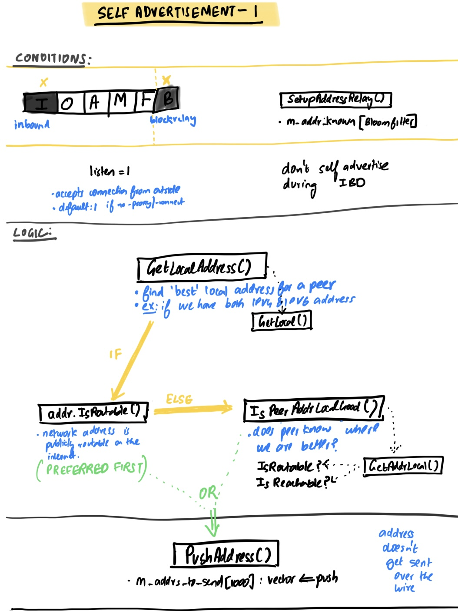
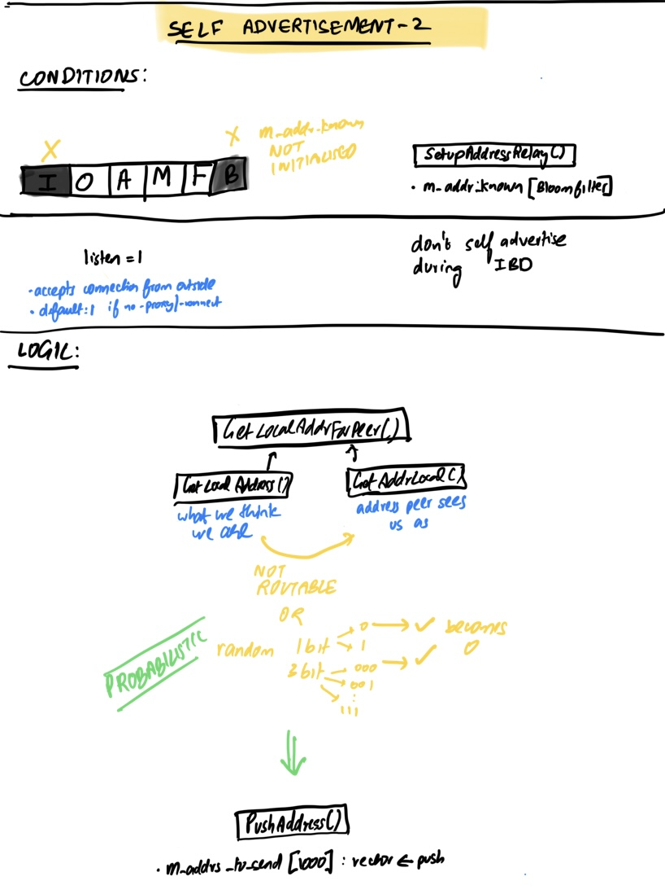

# self advertisement

## concept
`2022-11-24T09:42:23Z [net] Advertising address dummy-ip-address to peer=33`
- we advertise our ip address to other nodes so that they can reach us.

## need
- if we initiate an outbound connection to a peer, peer wouldn't know how to reach us
- so we tell the peer how to reach us by announcing our address
- sometimes we end up announcing our address even when we are unreachable
	- e.g. if we're behind a NAT, or the port for bitcoin is blocked by our firewall
	- if we don't accept inbound connections, we can set listen=0 to not self advertise our address
  
## method

Self advertisement is done in 2 areas of the codebase with slightly different logic. See [PR 26199](https://github.com/bitcoin/bitcoin/pull/26199).

### 1. self advertisement during version processing mechanism (will disappear if #26199 gets merged)
- see [link](https://github.com/bitcoin/bitcoin/blob/bdcafb913398f0cdaff9c880618f9ebfc85c7693/src/net_processing.cpp#L3278-L3307)
-  
- `ThreadMessageHandler()` -> `ProcessMessages()` -> `ProcessMessage()` 

Advantage/Disadvantage?

### 2. self advertisement during `MaybeSendAddr` mechanism
- see [link](https://github.com/bitcoin/bitcoin/blob/bdcafb913398f0cdaff9c880618f9ebfc85c7693/src/net_processing.cpp#L5077-L5094)
- 
- `ThreadMessageHandler()` -> `SendMessages()` -> `MaybeSendAddr()`
- 

### 3. Behaviour possibilities
1.  not desired = two self-ads in one ADDR message (one added in Version processing, one added in MaybeSendAddr if they are different).
		= ex: if we discovered a local IPv6 address and our peer sees us under a IPv4 address (do we need it?)
2.  continuously spam us with our own address from other connections (but with bad metadata), and thus prevent us from sending our self-advertisement (with correct metadata) to new peers because they'd inserted a duplicate

## component functions
- `SetupAddressRelay()`
- 

## history
Pretty interesting history for the version processing mechanism:
1. [added in 2010 in main.cpp (before GitHub!)](https://github.com/TheBlueMatt/bitcoin/commit/c891967b6fcab2e8dc4ce0c787312b36c07efa4d#diff-608d8de3fba954c50110b6d7386988f27295de845e9d7174e40095ba5efcf1bbR2175)
2. [moved in 2016 to src/net_processing.cpp](https://github.com/bitcoin/bitcoin/pull/9260/commits/e736772c56a883e2649cc8534dd7857a0718ec56#diff-6875de769e90cec84d2e8a9c1b962cdbcda44d870d42e4215827e599e11e90e3R1184)

the code in `MaybeSendAddr()` was also historically there.
1. [added in 2009 in main.cpp (good chance that it's satoshi's hand :eyes:)](https://github.com/bitcoin/bitcoin/commit/e4c05d31778a85014b2a52e2f20753b38dfbf950#diff-608d8de3fba954c50110b6d7386988f27295de845e9d7174e40095ba5efcf1bbR2103)
2. [moved in 2016 to src/net_processing.cpp](https://github.com/bitcoin/bitcoin/commit/e736772c56a883e2649cc8534dd7857a0718ec56#diff-34d21af3c614ea3cee120df276c9c4ae95053830d7f1d3deaf009a4625409ad2L6601)
 
