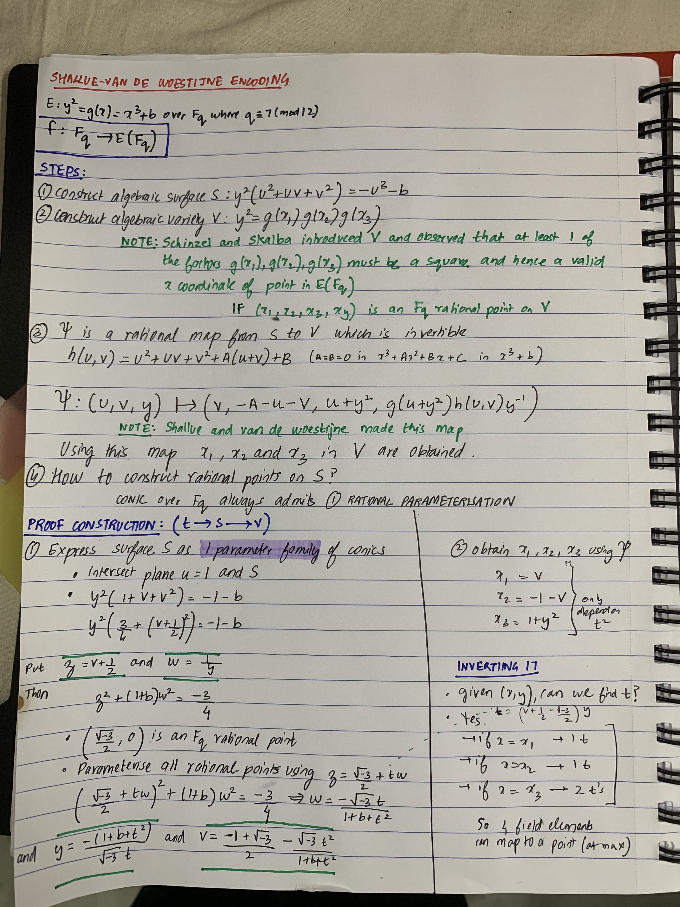
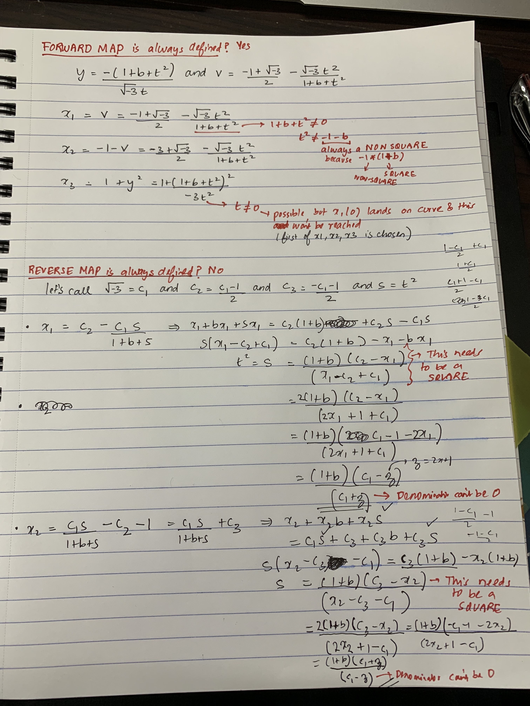

# Shallue–van de Woestijne encoding
- Description: Shallue–van de Woestijne encoding basics needed for Elligator Squared
- Date: 12/Aug/2022
- Author: [@stratospher](https://github.com/stratospher)
- **Index:**
    - [Introduction](#introduction)
    - [Proof](#proof)
    - [When does the forward map and reverse map not exist?](#when-does-forward-map-and-reverse-map-not-exist)
    - [Why is it indifferentiable?](#why-is-it-indifferentiable)
    - [References](#references)

## Introduction
- not indifferentiable from a random oracle
- random oracle: math model of ideal hash function
- input x ∈ X to h, h(x) is equivalent to random response chosen uniformly from y

## Proof

## When does forward map and reverse map not exist?

todo: insert remaining calculations

## Why is it indifferentiable?

## Exponentiation?

## References
Theorem Papers:
1. https://gist.github.com/stratospher/a098922e7040669c65cf23b434727e46
