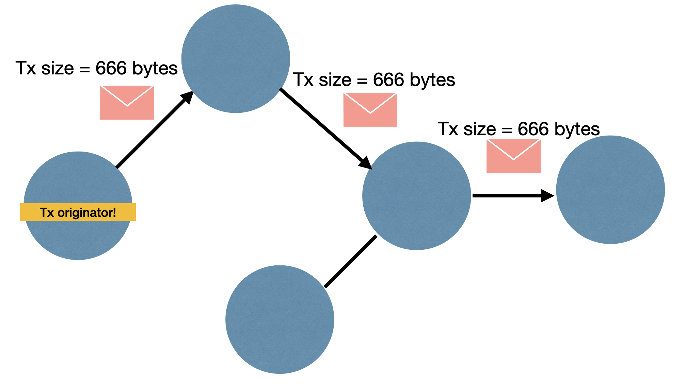
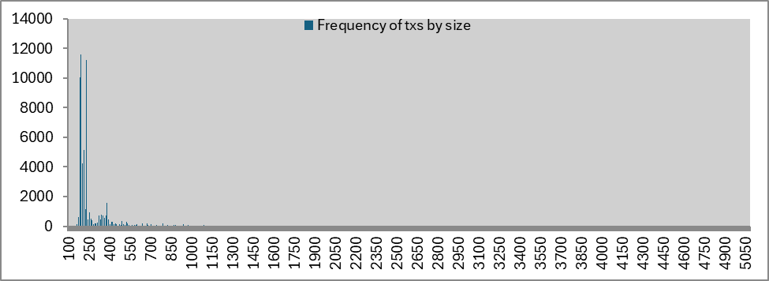
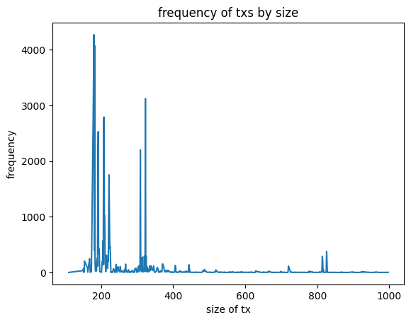

# I still see you!

## Problem

Sending transactions across the P2P network is sensitive data.

Global passive observers can differentiate whether it's this tx or that tx from the size of the packet!

## Statistics

### Common transaction size (in bytes) in the last 100 blocks

- 96.7 % of transactions below 1000 bytes
- 99% of transactions below 3000 bytes

### Common transaction size (in bytes) in the mempool

- 89.6 % of transactions below 1000 bytes
- 92% of transactions below 3000 bytes

## Solution

1. Pad transaction messages

- last 100 blocks

  |                          | pad to a fixed size=1000 | pad to a fixed size=3000 | pad to a dynamic size |
  |--------------------------|--------------------------|--------------------------|-----------------------|
  | how much padding?        | 1000                     | 3000                     | Padmé algo            |
  | what is extra bandwidth? | 43 MB                    | 162 MB                   | 10.9 GB               |

- mempool

   |                          | pad to a fixed size=1000 | pad to a fixed size=3000 | pad to a dynamic size |
   |--------------------------|--------------------------|--------------------------|-----------------------|
   | how much padding?        | 1000                     | 3000                     | Padmé algo            |
   | what is extra bandwidth? | 37 MB                    | 139.8 MB                 | 123 MB                |

2. Broadcast decoy messages with size (transaction message)

## Code

- branch - https://github.com/stratospher/bitcoin/tree/2024-05-tx-traffic
- jupyter notebook - https://colab.research.google.com/drive/1q2fLkxuAiqr2hlAEQ4r6x2Lx9bTh4bN0?usp=sharing

## Conclusion

|                 | advantage                | disadvantage                                                           |
|-----------------|--------------------------|------------------------------------------------------------------------|
| fixed padding   | bandwidth efficient      | can't hide the outliers + optimal padding might vary based on data set |
| dynamic padding | covers even the outliers | too much bandwidth                                                     |
